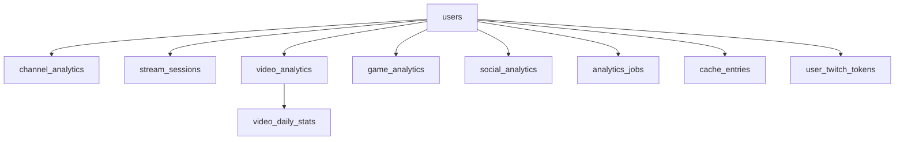

# 🗄️ **CreatorSync Database Schema**

> **Last Updated**: 2025-05-25  
> **Environment**: Production & Staging (PostgreSQL)  
> **Version**: v1.2

## 📊 **Table Overview**

| Table Name | Purpose | Records | Status |
|------------|---------|---------|--------|
| [`users`](#users) | Creator profiles and basic info | User accounts | ✅ Active |
| [`user_twitch_tokens`](#user_twitch_tokens) | Encrypted OAuth tokens | Authentication | ✅ Active |
| [`channel_analytics`](#channel_analytics) | Daily channel metrics | Analytics | ✅ Active |
| [`stream_sessions`](#stream_sessions) | Individual stream performance | Analytics | ✅ Active |
| [`video_analytics`](#video_analytics) | Video/VOD performance data | Analytics | ✅ Active |
| [`video_daily_stats`](#video_daily_stats) | Daily video performance tracking | Analytics | ✅ Active |
| [`game_analytics`](#game_analytics) | Performance by game/category | Analytics | ✅ Active |
| [`social_analytics`](#social_analytics) | Cross-platform social metrics | Analytics | ✅ Active |
| [`analytics_jobs`](#analytics_jobs) | Data collection job tracking | System | ✅ Active |
| [`cache_entries`](#cache_entries) | Analytics data caching | Performance | ✅ Active |
| [`migrations`](#migrations) | Migration tracking | System | ✅ Active |

---

## 🏗️ **Table Structures**

### `users`
**Purpose**: Stores creator profiles and basic account information
```sql
CREATE TABLE users (
    id VARCHAR(255) PRIMARY KEY,                    -- Internal user ID
    clerk_user_id VARCHAR(255) UNIQUE NOT NULL,    -- Clerk authentication ID
    twitch_user_id VARCHAR(255),                    -- Twitch platform ID
    username VARCHAR(255),                          -- Display username
    display_name VARCHAR(255),                      -- Full display name
    email VARCHAR(255),                             -- User email
    profile_image_url TEXT,                         -- Avatar URL
    created_at TIMESTAMP WITH TIME ZONE DEFAULT NOW(),
    updated_at TIMESTAMP WITH TIME ZONE DEFAULT NOW()
);
```
**Key Relationships**: 
- Referenced by all analytics tables via `user_id`
- Links to `user_twitch_tokens` via `clerk_user_id`

---

### `user_twitch_tokens`
**Purpose**: Securely stores encrypted Twitch OAuth tokens
```sql
CREATE TABLE user_twitch_tokens (
    clerk_user_id VARCHAR(255) PRIMARY KEY,        -- Links to users.clerk_user_id
    twitch_user_id VARCHAR(255) NOT NULL UNIQUE,   -- Twitch platform user ID
    encrypted_access_token TEXT NOT NULL,          -- Encrypted access token
    encrypted_refresh_token TEXT NOT NULL,         -- Encrypted refresh token
    scopes TEXT,                                    -- OAuth scopes granted
    expires_at TIMESTAMPTZ NOT NULL,               -- Token expiration
    created_at TIMESTAMPTZ DEFAULT CURRENT_TIMESTAMP NOT NULL,
    updated_at TIMESTAMPTZ DEFAULT CURRENT_TIMESTAMP NOT NULL
);
```
**Indexes**:
- `idx_user_twitch_tokens_twitch_user_id` on `twitch_user_id`
- `idx_user_twitch_tokens_expires_at` on `expires_at`

**Security**: All tokens are encrypted at rest using application-level encryption

---

### `channel_analytics`
**Purpose**: Daily snapshots of channel metrics (followers, views, etc.)
```sql
CREATE TABLE channel_analytics (
    id SERIAL PRIMARY KEY,
    user_id VARCHAR(255) REFERENCES users(id) ON DELETE CASCADE,
    date DATE NOT NULL,                             -- Snapshot date
    followers_count INTEGER DEFAULT 0,             -- Daily follower count
    following_count INTEGER DEFAULT 0,             -- Following count
    total_views INTEGER DEFAULT 0,                 -- Cumulative view count
    subscriber_count INTEGER DEFAULT 0,            -- Subscriber count
    created_at TIMESTAMP WITH TIME ZONE DEFAULT NOW(),
    UNIQUE(user_id, date)                          -- One record per user per day
);
```
**Indexes**:
- `idx_channel_analytics_user_date` on `(user_id, date DESC)`

---

### `stream_sessions`
**Purpose**: Individual stream performance and metrics
```sql
CREATE TABLE stream_sessions (
    id SERIAL PRIMARY KEY,
    user_id VARCHAR(255) REFERENCES users(id) ON DELETE CASCADE,
    stream_id VARCHAR(255) UNIQUE,                 -- Twitch stream ID
    title TEXT,                                     -- Stream title
    game_name VARCHAR(255),                         -- Game/category name
    game_id VARCHAR(255),                           -- Twitch game ID
    started_at TIMESTAMP WITH TIME ZONE,           -- Stream start time
    ended_at TIMESTAMP WITH TIME ZONE,             -- Stream end time
    duration_minutes INTEGER,                       -- Stream duration
    peak_viewers INTEGER DEFAULT 0,                -- Highest concurrent viewers
    average_viewers INTEGER DEFAULT 0,             -- Average concurrent viewers
    total_chatters INTEGER DEFAULT 0,              -- Unique chatters
    followers_gained INTEGER DEFAULT 0,            -- New followers from stream
    subscribers_gained INTEGER DEFAULT 0,          -- New subscribers from stream
    created_at TIMESTAMP WITH TIME ZONE DEFAULT NOW()
);
```
**Indexes**:
- `idx_stream_sessions_user_started` on `(user_id, started_at DESC)`

---

### `video_analytics`
**Purpose**: Video/VOD performance metrics and metadata
```sql
CREATE TABLE video_analytics (
    id SERIAL PRIMARY KEY,
    user_id VARCHAR(255) REFERENCES users(id) ON DELETE CASCADE,
    video_id VARCHAR(255) UNIQUE NOT NULL,         -- Twitch video ID
    title TEXT,                                     -- Video title
    video_type VARCHAR(50),                         -- 'vod', 'highlight', 'clip', 'upload'
    duration_seconds INTEGER,                       -- Video length
    view_count INTEGER DEFAULT 0,                  -- Total views
    like_count INTEGER DEFAULT 0,                  -- Total likes
    comment_count INTEGER DEFAULT 0,               -- Total comments
    thumbnail_url TEXT,                             -- Video thumbnail
    published_at TIMESTAMP WITH TIME ZONE,         -- Publication date
    created_at TIMESTAMP WITH TIME ZONE DEFAULT NOW(),
    updated_at TIMESTAMP WITH TIME ZONE DEFAULT NOW()
);
```
**Indexes**:
- `idx_video_analytics_user_published` on `(user_id, published_at DESC)`

---

### `video_daily_stats`
**Purpose**: Daily tracking of video performance changes
```sql
CREATE TABLE video_daily_stats (
    id SERIAL PRIMARY KEY,
    video_id VARCHAR(255) REFERENCES video_analytics(video_id) ON DELETE CASCADE,
    date DATE NOT NULL,                             -- Stats date
    view_count INTEGER DEFAULT 0,                  -- Views on this date
    like_count INTEGER DEFAULT 0,                  -- Likes on this date
    comment_count INTEGER DEFAULT 0,               -- Comments on this date
    watch_time_minutes INTEGER DEFAULT 0,          -- Total watch time
    created_at TIMESTAMP WITH TIME ZONE DEFAULT NOW(),
    UNIQUE(video_id, date)                         -- One record per video per day
);
```
**Indexes**:
- `idx_video_daily_stats_video_date` on `(video_id, date DESC)`

---

### `game_analytics`
**Purpose**: Performance metrics by game/category
```sql
CREATE TABLE game_analytics (
    id SERIAL PRIMARY KEY,
    user_id VARCHAR(255) REFERENCES users(id) ON DELETE CASCADE,
    game_id VARCHAR(255),                           -- Twitch game ID
    game_name VARCHAR(255),                         -- Game display name
    total_streams INTEGER DEFAULT 0,               -- Number of streams
    total_hours_streamed DECIMAL(10,2) DEFAULT 0,  -- Total streaming time
    average_viewers DECIMAL(10,2) DEFAULT 0,       -- Average viewership
    peak_viewers INTEGER DEFAULT 0,                -- Highest concurrent viewers
    total_followers_gained INTEGER DEFAULT 0,      -- Followers gained from this game
    last_streamed_at TIMESTAMP WITH TIME ZONE,     -- Most recent stream
    created_at TIMESTAMP WITH TIME ZONE DEFAULT NOW(),
    updated_at TIMESTAMP WITH TIME ZONE DEFAULT NOW(),
    UNIQUE(user_id, game_id)                       -- One record per user per game
);
```
**Indexes**:
- `idx_game_analytics_user_hours` on `(user_id, total_hours_streamed DESC)`

---

### `social_analytics`
**Purpose**: Cross-platform social media metrics (future expansion)
```sql
CREATE TABLE social_analytics (
    id SERIAL PRIMARY KEY,
    user_id VARCHAR(255) REFERENCES users(id) ON DELETE CASCADE,
    platform VARCHAR(50),                          -- 'twitter', 'youtube', 'instagram', 'tiktok'
    date DATE NOT NULL,                             -- Metrics date
    followers_count INTEGER DEFAULT 0,             -- Platform followers
    posts_count INTEGER DEFAULT 0,                 -- Posts/content count
    engagement_rate DECIMAL(5,2) DEFAULT 0,        -- Engagement percentage
    impressions INTEGER DEFAULT 0,                 -- Content impressions
    clicks INTEGER DEFAULT 0,                      -- Link clicks
    created_at TIMESTAMP WITH TIME ZONE DEFAULT NOW(),
    UNIQUE(user_id, platform, date)               -- One record per user per platform per day
);
```

---

### `analytics_jobs`
**Purpose**: Tracks data collection job status and errors
```sql
CREATE TABLE analytics_jobs (
    id SERIAL PRIMARY KEY,
    user_id VARCHAR(255) REFERENCES users(id) ON DELETE CASCADE,
    job_type VARCHAR(100),                          -- 'daily_channel', 'stream_session', 'video_stats'
    status VARCHAR(50),                             -- 'pending', 'running', 'completed', 'failed'
    started_at TIMESTAMP WITH TIME ZONE,           -- Job start time
    completed_at TIMESTAMP WITH TIME ZONE,         -- Job completion time
    error_message TEXT,                             -- Error details if failed
    data_date DATE,                                 -- Date of data being collected
    created_at TIMESTAMP WITH TIME ZONE DEFAULT NOW()
);
```
**Indexes**:
- `idx_analytics_jobs_user_type` on `(user_id, job_type, created_at DESC)`

---

### `cache_entries`
**Purpose**: Analytics data caching for performance optimization
```sql
CREATE TABLE cache_entries (
    id SERIAL PRIMARY KEY,
    user_id VARCHAR(255) NOT NULL,                 -- Links to users
    cache_key VARCHAR(255) NOT NULL,               -- Cache identifier
    cache_data JSONB,                              -- Cached data (JSON)
    expires_at TIMESTAMP WITH TIME ZONE NOT NULL,  -- Cache expiration
    created_at TIMESTAMP WITH TIME ZONE DEFAULT NOW(),
    updated_at TIMESTAMP WITH TIME ZONE DEFAULT NOW(),
    UNIQUE(user_id, cache_key)                     -- One cache entry per user per key
);
```
**Indexes**:
- `idx_cache_entries_user_key` on `(user_id, cache_key)`
- `idx_cache_entries_expires_at` on `expires_at`

**Cache Keys**:
- `connection_status` - User connection status (TTL: 2 min)
- `enhanced_{days}` - Enhanced analytics data (TTL: 5 min)
- `overview` - Dashboard overview data (TTL: 3 min)
- `chartdata_{days}` - Chart visualization data (TTL: 10 min)

---

### `migrations`
**Purpose**: Tracks applied database migrations
```sql
CREATE TABLE migrations (
    id SERIAL PRIMARY KEY,
    filename VARCHAR(255) NOT NULL UNIQUE,         -- Migration file name
    executed_at TIMESTAMP DEFAULT CURRENT_TIMESTAMP -- Execution timestamp
);
```

---

## 🔗 **Relationships & Dependencies**



## 🎯 **Data Collection Flow**

1. **User Authentication**: OAuth tokens stored in `user_twitch_tokens`
2. **Daily Collection**: Channel metrics → `channel_analytics`
3. **Stream Collection**: Live stream data → `stream_sessions`
4. **Video Collection**: VODs/clips → `video_analytics`
5. **Daily Video Tracking**: View changes → `video_daily_stats`
6. **Game Analysis**: Aggregated game data → `game_analytics`
7. **Job Tracking**: All operations → `analytics_jobs`
8. **Performance**: Frequent queries → `cache_entries`

## 🚀 **Performance Considerations**

### **Indexes**
- All foreign keys are indexed
- Date ranges have composite indexes
- Cache expiration is indexed for cleanup

### **Partitioning** (Future)
- Consider partitioning large tables by date
- `video_daily_stats` and `channel_analytics` candidates for monthly partitions

### **Archival** (Future)
- Old `analytics_jobs` (>90 days) can be archived
- Expired `cache_entries` are automatically cleaned up

## 🔧 **Maintenance Tasks**

### **Regular**
- Monitor `cache_entries` size and cleanup expired entries
- Check `analytics_jobs` for failed jobs
- Archive old job records

### **Periodic**
- Analyze query performance on date-range queries
- Update table statistics
- Monitor storage growth

## 📝 **Migration History**

| Migration | Date | Description |
|-----------|------|-------------|
| `001_create_analytics_tables.sql` | 2025-05-25 | Initial analytics schema |
| `002_create_user_twitch_tokens.sql` | 2025-05-25 | OAuth token storage |
| Manual: `cache_entries` | 2025-05-25 | Analytics caching table |

---

> **🎯 Next Steps**: Consider adding YouTube and TikTok token tables when expanding platform support 